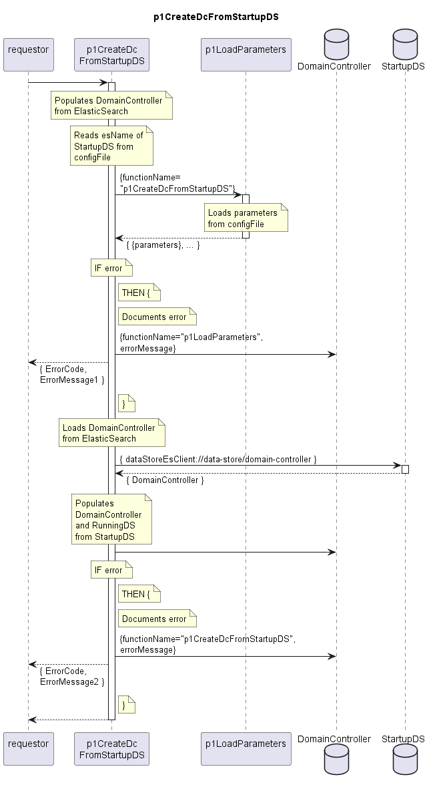

# p1CreateDcFromStartupDS

Builds up the data structure of the DomainController from ElasticSearch.  
Loads the configuration information that is directly attached to the DomainController and the persistent copy of the RunningDS (StartupDS).  

## Diagram

  

## Interface

Please find a detailed description of the [interface](./interface.yaml).  

## Variables

Please find a detailed description of the [variables](./variables.yaml).  

## Error Codes

|#| Code | Message                                                           |
|-|------|-------------------------------------------------------------------|
|1|      | _[provided by p1LoadParameters]_                                  |
|2|      | _[provided by p1CreateDcFromStartupDS]_                           |

## Parameters

./.  

## NPM Module

[onf-core-model-ap](https://www.npmjs.com/package/onf-core-model-ap) to be complemented.  
