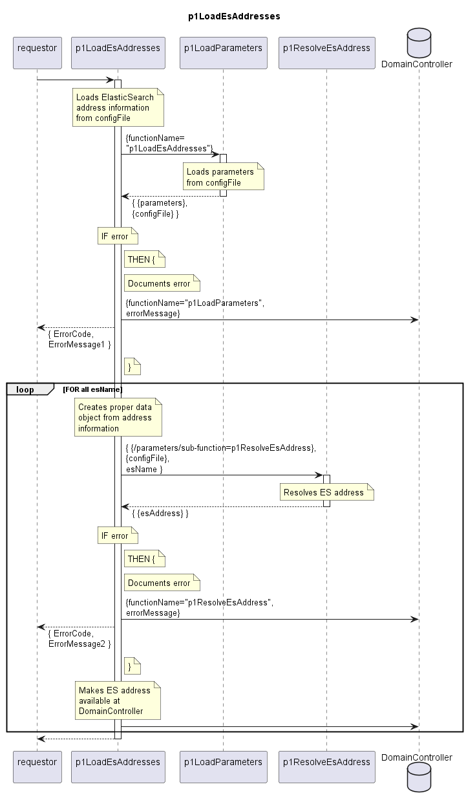

# p1LoadEsAddresses

Loads ElasticSearch addresses from the configuration file and makes them available at the DomainController.  

## Diagram

  

## Interface

Please find a detailed description of the [interface](./interface.yaml).  

## Variables

Please find a detailed description of the [variables](./variables.yaml).  

## Error Codes

|#| Code | Message                                                           |
|-|------|-------------------------------------------------------------------|
|1|      | _[provided by p1LoadParameters]_                                  |
|2|      | _[provided by p1ResolveEsAddress]_                                |

## Parameters

| Parameter Name | Description                                                                                                                                                                                       |
|----------------|---------------------------------------------------------------------------------------------------------------------------------------------------------------------------------------------------|
| [esName]       | Special usage of the parameters. For all parameters with attribute purpose==esName, attribute value contains the value of the key attribute name of the list of ElasticSearchClients [es-address] |

In its initial release, the ElasticSearchClients domainControllerEsClient and mwdiEsClient are defined.  

## NPM Module

[mw-sdn-p1-load-es-addresses](https://www.npmjs.com/package/mw-sdn-p1-load-es-addresses)  
