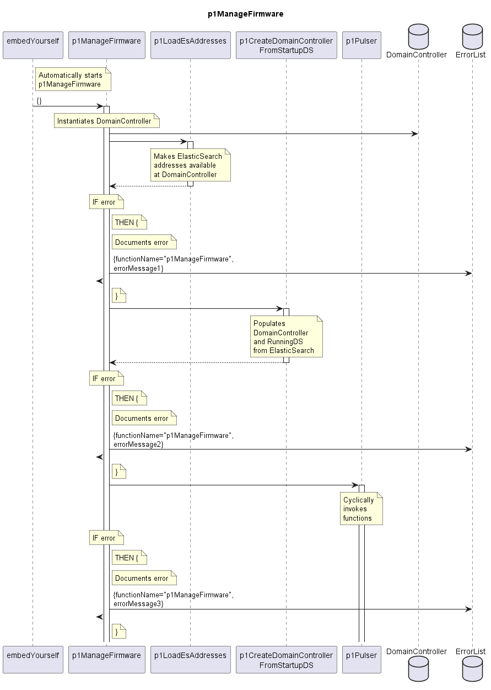

# p1ManageFirmware

Startup of the autonomous firmware management.  

## Diagram

  

## Interface

Please find a detailed description of the [interface](./interface.yaml).  

## Variables

Please find a detailed description of the [variables](./variables.yaml).  

## Error Codes

|#| Code | Message                                                                                       |
|-|------|-----------------------------------------------------------------------------------------------|
|1|      | Firmware management stopped as ElasticSearch addresses could not be loaded                    |
|2|      | Firmware management stopped as initial DomainController data or StartupDS could not be loaded |
|3|      | Firmware management stopped as starting the Pulser failed                                     |

## Parameters

./.  

## NPM Module

[onf-core-model-ap](https://www.npmjs.com/package/onf-core-model-ap) to be complemented.  
