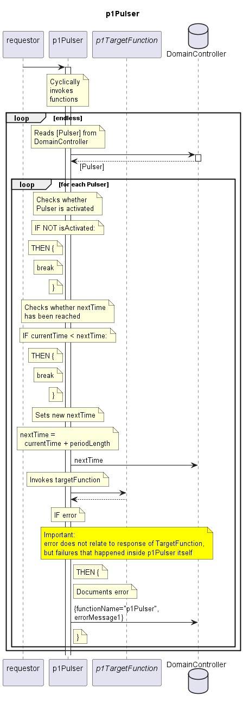

# p1Pulser

Cyclically invokes functions of all categories.  
Both request and response must be without any body.  
Configured through DomainController::Pulser.  

## Diagram

  

## Interface

Please find a detailed description of the [interface](./interface.yaml).  

## Variables

Please find a detailed description of the [variables](./variables.yaml).  

## Error Codes

|#| Code | Message                                                           |
|-|------|-------------------------------------------------------------------|
|1|      | targetFunction could not be reached                               |

## Parameters

./.  

## NPM Module

[onf-core-model-ap](https://www.npmjs.com/package/onf-core-model-ap) to be complemented.  
