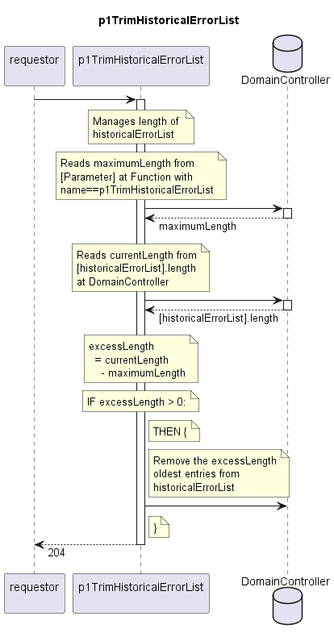

# p1TrimHistoricalErrorList

Deletes the oldest entries until maximumLength is no longer exceeded.  

## Diagram

  

## Interface

Please find a detailed description of the [interface](./interface.yaml).  

## Variables

Please find a detailed description of the [variables](./variables.yaml).  

## Error Codes

./.

## Parameters

./.

## NPM Module

[mw-sdn-p1-trim-historical-error-list](https://www.npmjs.com/package/mw-sdn-p1-trim-historical-error-list)  
