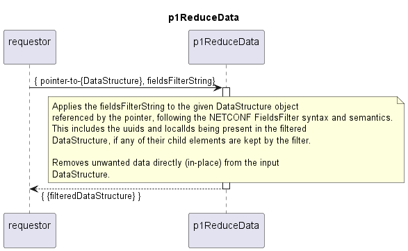

# p1ReduceData

Filters a provided data structure according to a provided fields filter string and returns the filtered data structure.  
The function does not create a copy of the input data structure, but removes data directly in-place.  

## Overview

The fields-filtering string must comply with the NETCONF definitions.  
The filtering itself follows the same definitions.  

## Diagram

  

## Interface

Please find a detailed description of the [interface](./interface.yaml).

## Variables

Please find a detailed description of the [variables](./variables.yaml).

## NPM Module  

[mw-sdn-p1-fields-filter](https://www.npmjs.com/package/mw-sdn-p1-fields-filter)  