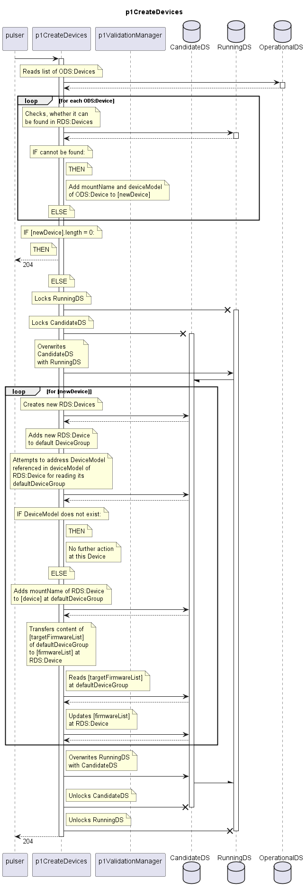

# p1CreateDevices

Function gets triggered by the Pulser.  
p1CreateDevices checks for Devices that exist in OperationalDS but not in RunningDS.  
New Devices get  
\- created in RunningDS  
\- referenced by the default DeviceGroup of the corresponding DeviceModel  
\- equipped with the targetFirmwareList of the default DeviceGroup.  

Consequences: The target firmware of the new Devices' DeviceModel will be attempted to be loaded onto the devices and activated.  

## Diagram

  

## Interface

Please find a detailed description of the [interface](./interface.yaml).  

## Variables

Please find a detailed description of the [variables](./variables.yaml).  

## Error Codes

./.  

## Parameters

./.  

## NPM Module

[onf-core-model-ap](https://www.npmjs.com/package/onf-core-model-ap) to be complemented.  
