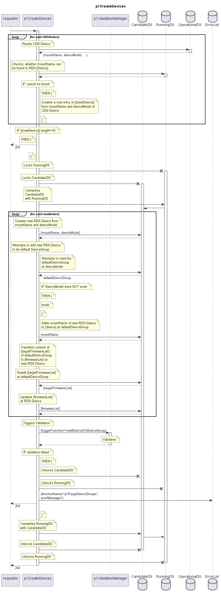

# p1CreateDevices

p1CreateDevices checks for Devices that exist in OperationalDS but not in RunningDS.  
New Devices get  
\- created in RunningDS  
\- referenced by the default DeviceGroup of the corresponding DeviceModel  
\- equipped with the targetFirmwareList of the default DeviceGroup  

Consequences: The target firmware definition of the new devices' respective default DeviceGroup will be applied on them. This might include downloading and activating the firmware.  

## Diagram

  

## Interface

Please find a detailed description of the [interface](./interface.yaml).  

## Variables

Please find a detailed description of the [variables](./variables.yaml).  

## Error Codes

|#| Code | Message                                                           |
|-|------|-------------------------------------------------------------------|
|1|      | _[provided by ValidationFunctions]_                               |

## Parameters

./.  

## NPM Module

[mw-sdn-p1-create-devices](https://www.npmjs.com/package/mw-sdn-p1-create-devices)  
