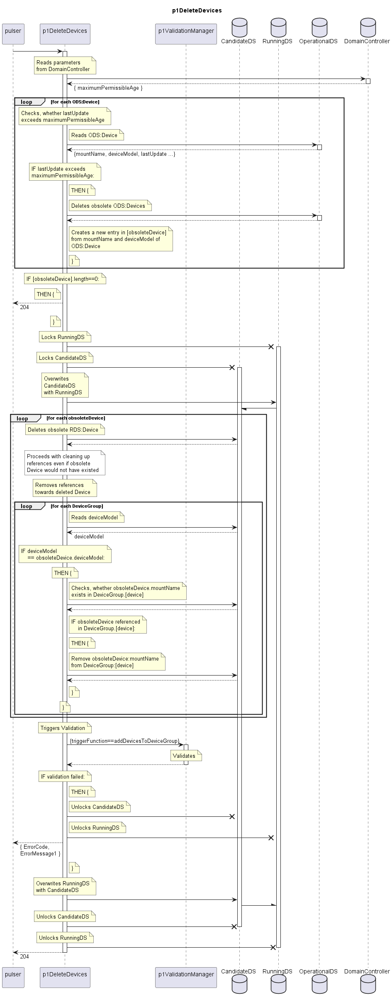

# p1DeleteDevices

Function gets triggered by the Pulser.  
p1DeleteDevices checks the OperationalDS for Devices with lastUpdate exceeding the maximumPermissibleAge.  
Obsolete Devices get  
\- deleted from OperationalDS  
\- deleted from RunningDS  
\- deleted from [device] in all DeviceGroups of the same deviceModel  

Consequences: If the device would be measured again some day, it would be equipped with the default target firmware.  

## Diagram

  

## Interface

Please find a detailed description of the [interface](./interface.yaml).  

## Variables

Please find a detailed description of the [variables](./variables.yaml).  

## Error Codes

./.  

## Parameters

| Parameter             | Description                                                                                  |
|-----------------------|----------------------------------------------------------------------------------------------|
| maximumPermissibleAge | Maximum permissible age of the Device in OperationalDS before it gets deleted from RunningDS |

## NPM Module

[mw-sdn-p1-delete-devices](https://www.npmjs.com/package/mw-sdn-p1-delete-devices)  
