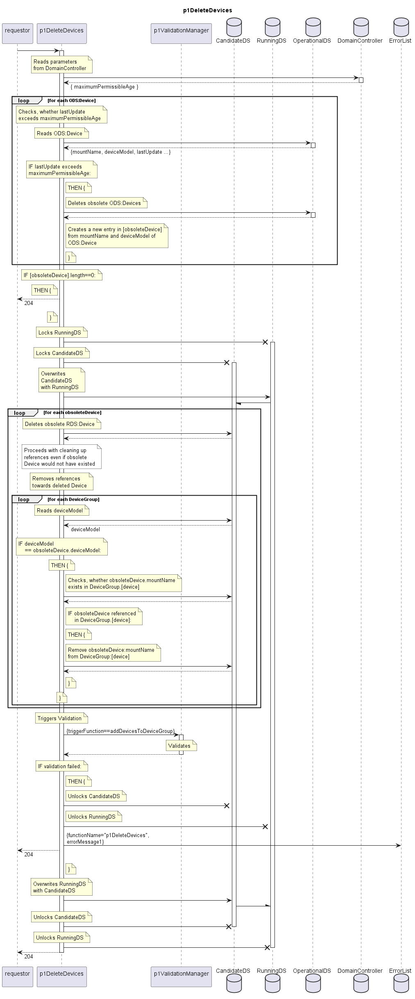

# p1DeleteDevices

p1DeleteDevices checks the OperationalDS for Devices with lastUpdate exceeding the maximumPermissibleAge.  
Obsolete Devices get  
\- deleted from OperationalDS  
\- deleted from RunningDS  
\- deleted from its DeviceGroup  

Consequences: If the device would be measured again some day, it would be equipped with the default target firmware.  

## Diagram

  

## Interface

Please find a detailed description of the [interface](./interface.yaml).  

## Variables

Please find a detailed description of the [variables](./variables.yaml).  

## Error Codes

|#| Code | Message                              |
|-|------|--------------------------------------|
|1|      | _[provided by ValidationFunctions]_  |

## Parameters

| Parameter             | Description                                                   |
|-----------------------|---------------------------------------------------------------|
| maximumPermissibleAge | Maximum permitted age of the device data in the OperationalDS |

## NPM Module

[mw-sdn-p1-delete-devices](https://www.npmjs.com/package/mw-sdn-p1-delete-devices)  
