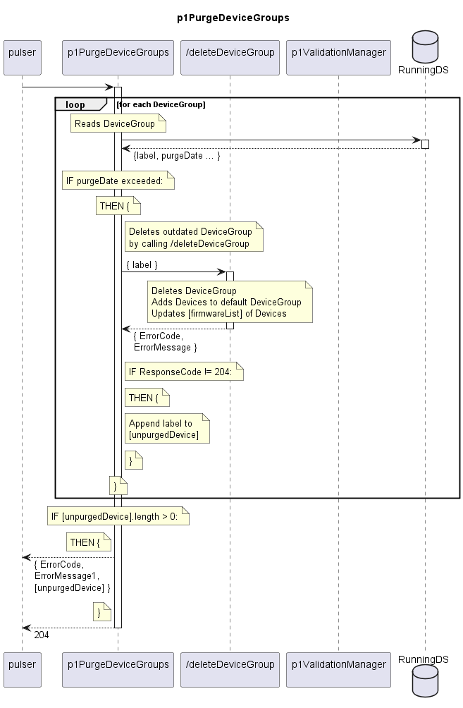

# p1PurgeDeviceGroups

Function gets triggered by the Pulser.  
It checks for all DeviceGroups whether the individual purgeDate has been exceeded.  
If the purgeDate has been exceeded, the /deleteDeviceGroup service is triggered.  

Consequences: If the device would be measured again some day, it would be equipped with the default target firmware.  

Dependencies: This function relies on calling the deleteDeviceGroup service.  

## Diagram

  

## Interface

Please find a detailed description of the [interface](./interface.yaml).  

## Variables

Please find a detailed description of the [variables](./variables.yaml).  

## Error Codes

|#| Code | Message                                         |
|-|------|-------------------------------------------------|
|1|      | DeviceGroup could not be purged.                |
  
## Parameters

./.

## NPM Module

[mw-sdn-p1-purge-device-groups](https://www.npmjs.com/package/mw-sdn-p1-purge-device-groups)  
