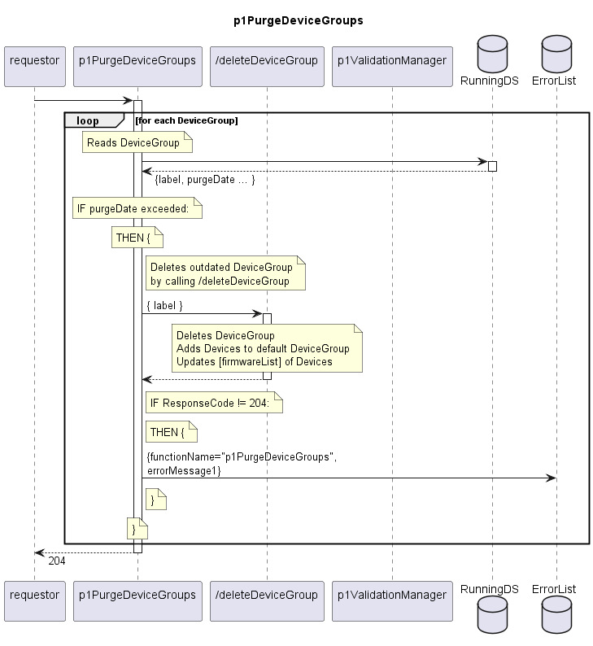

# p1PurgeDeviceGroups

Checks all DeviceGroups for exceeded purgeDate.  
If purgeDate exceeded, the /deleteDeviceGroup service is called.  

Consequences: See [/deleteDeviceGroup](../../../../Services/deleteDeviceGroup/1.0.0/).  

## Diagram

  

## Interface

Please find a detailed description of the [interface](./interface.yaml).  

## Variables

Please find a detailed description of the [variables](./variables.yaml).  

## Error Codes

|#| Code | Message                                         |
|-|------|-------------------------------------------------|
|1|      | DeviceGroup could not be purged.                |
  
## Parameters

./.

## NPM Module

[mw-sdn-p1-purge-device-groups](https://www.npmjs.com/package/mw-sdn-p1-purge-device-groups)  
