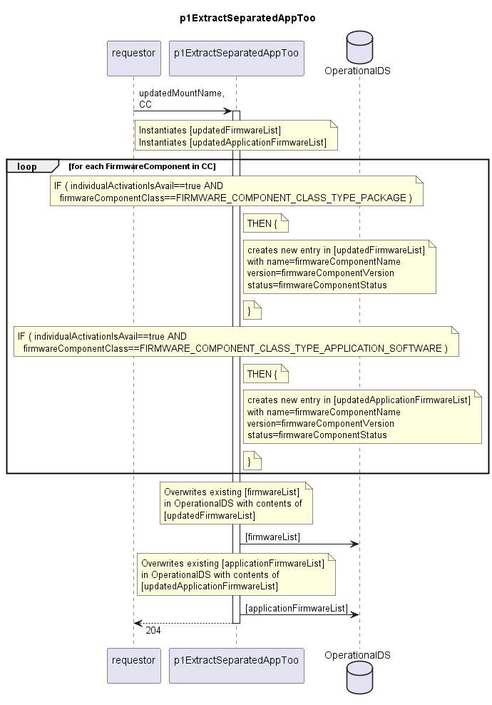

# p1ExtractSeparatedAppToo

Documents the activatable firmware components of both firmwareComponentClass FIRMWARE_COMPONENT_CLASS_TYPE_PACKAGE and FIRMWARE_COMPONENT_CLASS_TYPE_APPLICATION_SOFTWARE.  
This function is used for all device types that need to manage one additional firmware of unknown purpose.  

## Diagram

  

## Interface

Please find a detailed description of the [interface](./interface.yaml).  

## Variables

Please find a detailed description of the [variables](./variables.yaml).  

## Error Codes

./.

## Parameters

./.  

## NPM Module

[mw-sdn-p1-extract-separated-app-too](https://www.npmjs.com/package/mw-sdn-p1-extract-separated-app-too)
