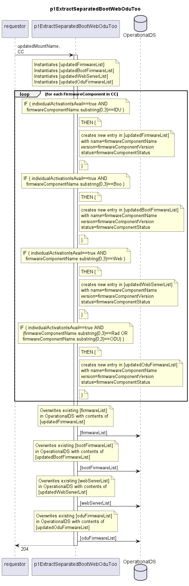

# p1ExtractSeparatedBootWebOduToo

Documents the activatable firmware components with firmwareComponentName starting with "IDU", "Boo", "Web", "Rad", or "ODU".  
This function is used for SIAE devices that need to manage additional firmware for booting, WebLCT, and ODUs.  

## Diagram

  

## Interface

Please find a detailed description of the [interface](./interface.yaml).  

## Variables

Please find a detailed description of the [variables](./variables.yaml).  

## Error Codes

./.

## Parameters

./.  

## NPM Module

[mw-sdn-p1-extract-separated-boot-web-odu-too](https://www.npmjs.com/package/mw-sdn-p1-extract-separated-boot-web-odu-too)
