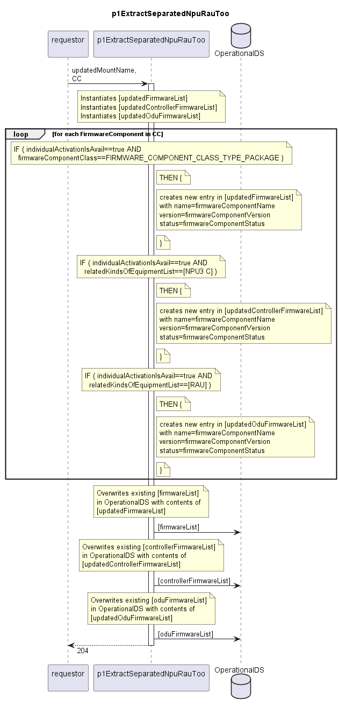

# p1ExtractSeparatedNpuRauToo

Documents the activatable firmware components of the firmwareComponentClass==FIRMWARE_COMPONENT_CLASS_TYPE_PACKAGE, and those with relatedKindsOfEquipmentList equal to [NPU3 C] or [RAU].  
This function is used for Ericsson devices that need to manage additional firmware for device controller and ODUs.  

## Diagram

  

## Interface

Please find a detailed description of the [interface](./interface.yaml).  

## Variables

Please find a detailed description of the [variables](./variables.yaml).  

## Error Codes

./.

## Parameters

./.  

## NPM Module

[mw-sdn-p1-extract-separated-npu-rau-too](https://www.npmjs.com/package/mw-sdn-p1-extract-separated-npu-rau-too)
