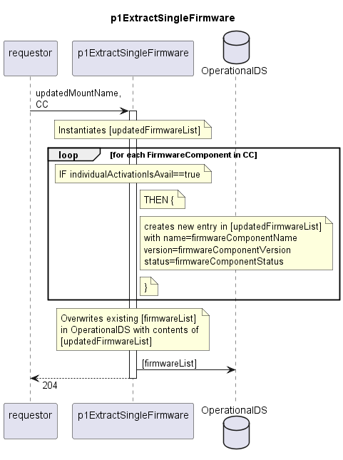

# p1ExtractSingleFirmware

Documents the activatable firmware components of a Device into the OperationalDS.  
This function is used for all device types that need to manage just the activatable firmware components of a single firmware component class.

## Diagram

  

## Interface

Please find a detailed description of the [interface](./interface.yaml).  

## Variables

Please find a detailed description of the [variables](./variables.yaml).  

## Error Codes

./.

## Parameters

./.  

## NPM Module

[mw-sdn-p1-extract-single-firmware](https://www.npmjs.com/package/mw-sdn-p1-extract-single-firmware)
