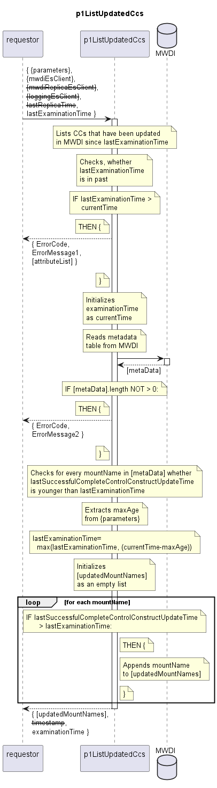

# p1ListUpdatedCcs

Determines the list of ControlConstructs that have been updated in MWDI since last update of OperationalDS.  

## Diagram

  

## Interface

Please find a detailed description of the [interface](./interface.yaml).  

## Variables

Please find a detailed description of the [variables](./variables.yaml).  

## Error Codes

|#| Code | Message                                                           |
|-|------|-------------------------------------------------------------------|
|1|      | Attribute's value is not valid                                    |
|2|      | ElasticSearch read error                                          |
|2|      | metadataTable not found in MWDI                                   |

## Parameters

| Parameter Name | Description                                                                 |
|----------------|-----------------------------------------------------------------------------|
| maxAge         | Maximum acceptable age of the update of a CC for its mountName being listed |

The maxAge parameter is basically for limiting the number of entries in the returned [updatedMountNames] during the first round, when lastExaminationTime starts with its default value.  

## NPM Module

[mw-sdn-p1-list-updated-ccs](https://www.npmjs.com/package/mw-sdn-p1-list-updated-ccs)
