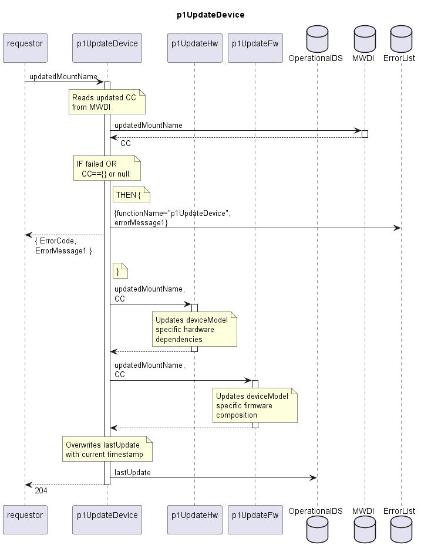

# p1UpdateDevice

Updates a Device in the OperationalDS.  

## Diagram

  

## Interface

Please find a detailed description of the [interface](./interface.yaml).  

## Variables

Please find a detailed description of the [variables](./variables.yaml).  

## Error Codes

|#| Code | Message                                                           |
|-|------|-------------------------------------------------------------------|
|1|      | ElasticSearch read error                                          |
|1|      | CC empty or null                                                  |

## Parameters

./.  

## NPM Module

[mw-sdn-p1-update-device](https://www.npmjs.com/package/mw-sdn-p1-update-device)
