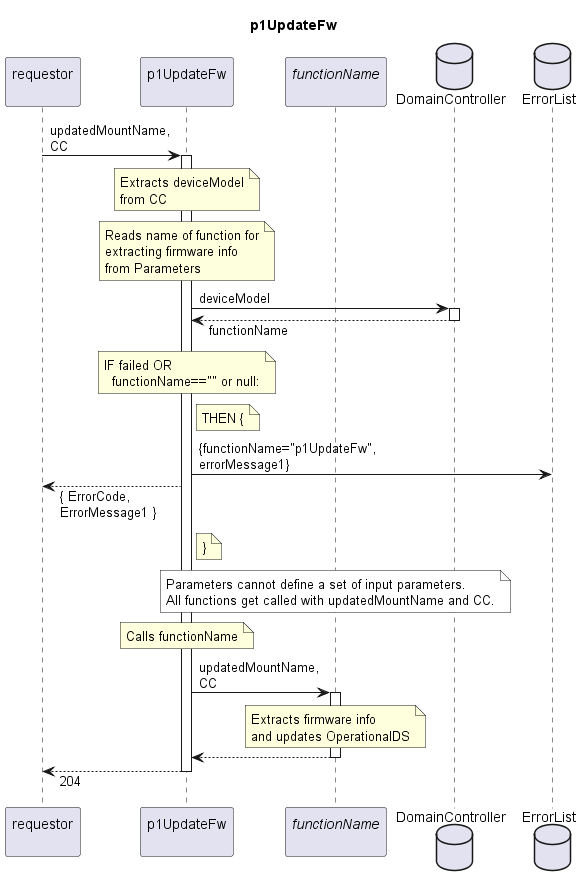

# p1UpdateFw

Updates the information about the composition of firmware on a Device in the OperationalDS.  
Depending on the deviceModel, different subfunctions get called to allow different information structures.  

## Diagram

  

## Interface

Please find a detailed description of the [interface](./interface.yaml).  

## Variables

Please find a detailed description of the [variables](./variables.yaml).  

## Error Codes

|#| Code | Message                                                           |
|-|------|-------------------------------------------------------------------|
|1|      | No firmware extraction function defined for deviceModel           |

## Parameters

./.  

## NPM Module

[mw-sdn-p1-update-fw](https://www.npmjs.com/package/mw-sdn-p1-update-fw)
