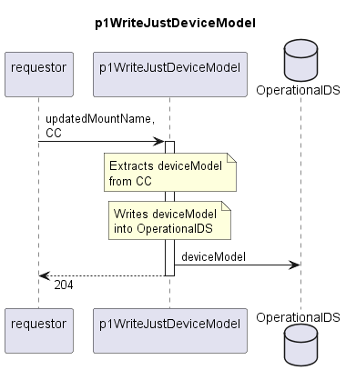

# p1WriteJustDeviceModel

Documents the deviceModel of a Device into the OperationalDS.  
This function is used for all device types for which the deviceModel is the only criterion for filtering the correct firmware components.  

## Diagram

  

## Interface

Please find a detailed description of the [interface](./interface.yaml).  

## Variables

Please find a detailed description of the [variables](./variables.yaml).  

## Error Codes

./.

## Parameters

./.  

## NPM Module

[mw-sdn-p1-write-just-device-model](https://www.npmjs.com/package/mw-sdn-p1-write-just-device-model)
