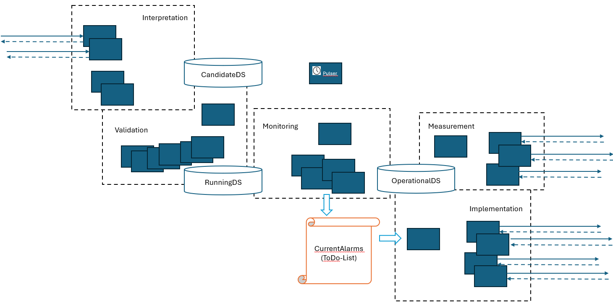

# Functions

The FirmWareManager is implementing the AutomationArchitecture.  

  

Functions have been grouped into:

- [Interpretation](./Interpretation/README.md)
- [Validation](./Validation/README.md)
- [Measurement](./Measurement/README.md)
- [Monitoring](./Monitoring/README.md)
- [Implementation](./Implementation/README.md)
