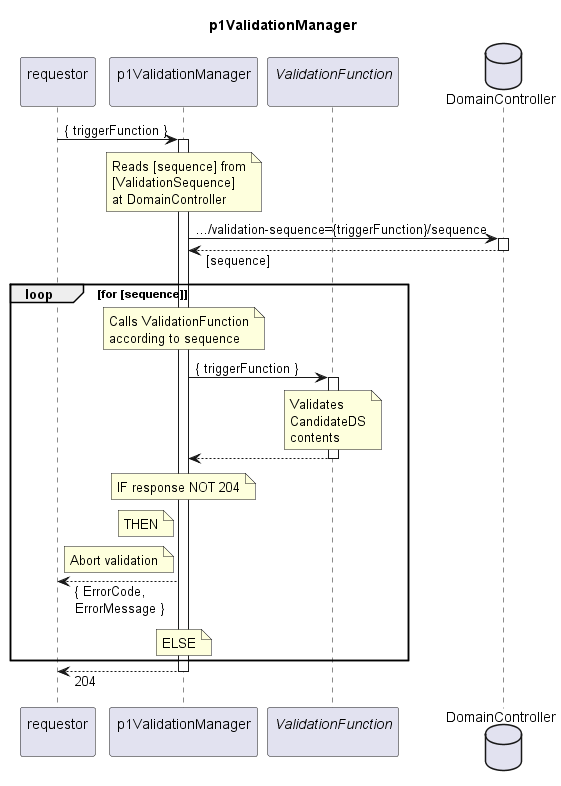

# p1ValidationManager

The p1ValidationManager gets addressed by every InterpretationService or -Function.  
It forwards this trigger to the ValidationFunctions according to the configuration of the ValidationSequence table.  

## Diagram

  

## Interface

Please find a detailed description of the [interface](./interface.yaml).  

## Variables

Please find a detailed description of the [variables](./variables.yaml).  

## Error Codes

./.  

## Parameters

**ValidationSequence Table:**

| triggerFunction             | sequence                                                         |
| --------------------------- | ---------------------------------------------------------------- |
| createDeviceModel           | p1EnsureEveryDeviceBeingReferredByOneDeviceGroupOfItsDeviceModel |
| deleteDeviceModel           | p1EnsureEveryDeviceBeingReferredByOneDeviceGroupOfItsDeviceModel |
| deleteDeviceGroup           | p1EnsureEveryDeviceBeingReferredByOneDeviceGroupOfItsDeviceModel |
| removeFirmwareApproval      | p1EnsureEveryDeviceReferencingExclusivelyApprovedFirmware        |
| addOrUpdateTargetFirmware   | p1EnsureEveryDeviceHasFirmwareAsTargetOfItsGroup                 |
| p1InstantiateDevice         | p1EnsureEveryDeviceBeingReferredByOneDeviceGroupOfItsDeviceModel   p1EnsureEveryDeviceHasFirmwareAsTargetOfItsGroup |
| addDevicesToDeviceGroup     | p1EnsureEveryDeviceBeingReferredByOneDeviceGroupOfItsDeviceModel   p1EnsureEveryDeviceHasFirmwareAsTargetOfItsGroup   p1EnsureEveryDeviceReferencingExclusivelyApprovedFirmware |
| removeDeviceFromDeviceGroup | p1EnsureEveryDeviceBeingReferredByOneDeviceGroupOfItsDeviceModel   p1EnsureEveryDeviceHasFirmwareAsTargetOfItsGroup   p1EnsureEveryDeviceReferencingExclusivelyApprovedFirmware |

## NPM Module

[mw-sdn-p1-validation-manager](https://www.npmjs.com/package/mw-sdn-p1-validation-manager)  
