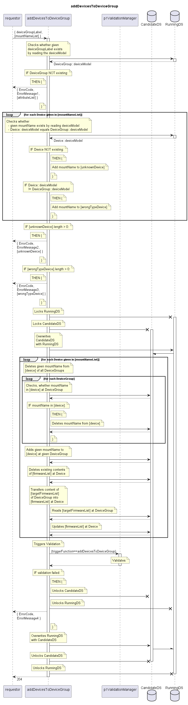

# addDevicesToDeviceGroup

Documents that given Devices are belonging to given DeviceGroup.  
Same Devices get also removed from their former DeviceGroup.  

## Diagram

  

## Interface

Please find a detailed description of the interface in the [openAPI specification](../../../FirmWareManager.yaml).  

## Variables

Please find a detailed description of the [variables](./variables.yaml).  

## Error Codes

| Code | Message                                                                                                  |
|------|----------------------------------------------------------------------------------------------------------|
|      | Referenced object does not exist                                                                         |
|      | Referenced device is unknown                                                                             |
|      | Referenced device of the wrong device type                                                               |

## Parameters

./.  

## NPM Module

[onf-core-model-ap](https://www.npmjs.com/package/onf-core-model-ap) to be complemented.  
