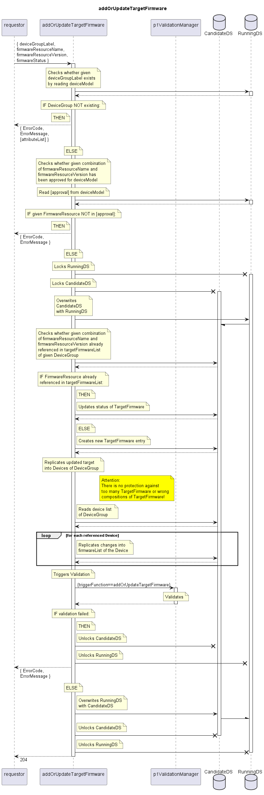

# addOrUpdateTargetFirmware

Adds a FirmwareResource to the targetFirmwareList of a given DeviceGroup.  
If the FirmwareResource would already be referenced, changes for example to its status will be applied.  
Adds the same firmware to the firmwareList of all Devices referenced by the same DeviceGroup.  

Consequences: The firmware will be attempted to be loaded onto the devices.  

## Diagram

  

## Interface

Please find a detailed description of the interface in the [openAPI specification](../../../FirmWareManager.yaml).  

## Variables

Please find a detailed description of the [variables](./variables.yaml).  

## Error Codes

| Code | Message                                                                                                  |
|------|----------------------------------------------------------------------------------------------------------|
|      | Referenced object does not exist                                                                         |

## Parameters

./.  

## NPM Module

[onf-core-model-ap](https://www.npmjs.com/package/onf-core-model-ap) to be complemented.  
