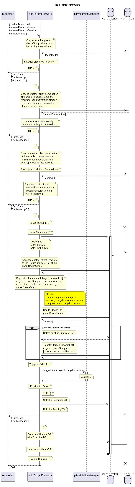

# addTargetFirmware

Adds a FirmwareResource to the targetFirmwareList of a given DeviceGroup.  
Adds the same firmware to the firmwareList of all Devices referenced by the given DeviceGroup.  

Attention: There is no protection against too many TargetFirmware or wrong compositions of TargetFirmware!

Consequences: The firmware will be attempted to be loaded onto the devices.  

## Diagram

  

## Interface

Please find a detailed description of the interface in the [openAPI specification](../../../FirmWareManager.yaml).  

## Variables

Please find a detailed description of the [variables](./variables.yaml).  

## Error Codes

|#| Code | Message                                                           |
|-|------|-------------------------------------------------------------------|
|1|      | Referenced object does not exist                                  |
|2|      | Firmware already referenced in targetFirmwareList                 |
|3|      | Firmware not approved for this device model                       |
|4|      | _[provided by ValidationFunctions]_                               |

## Parameters

./.  

## NPM Module

[onf-core-model-ap](https://www.npmjs.com/package/onf-core-model-ap) to be complemented.  
