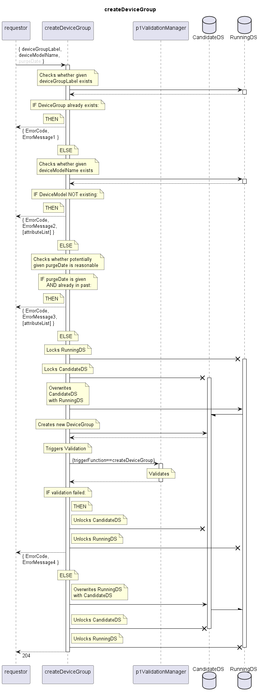

# createDeviceGroup

Creates a new DeviceGroup.  

## Diagram

  

## Interface

Please find a detailed description of the interface in the [openAPI specification](../../../FirmWareManager.yaml).  

## Variables

Please find a detailed description of the [variables](./variables.yaml).  

## Error Codes

|#| Code | Message                                                           |
|-|------|-------------------------------------------------------------------|
|1|      | deviceGroupLabel already exists                                   |
|2|      | Referenced object does not exist                                  |
|3|      | Attribute's value is not valid                                    |
|4|      | _[provided by ValidationFunctions]_                               |

## Parameters

./.  

## NPM Module

[onf-core-model-ap](https://www.npmjs.com/package/onf-core-model-ap) to be complemented.  
