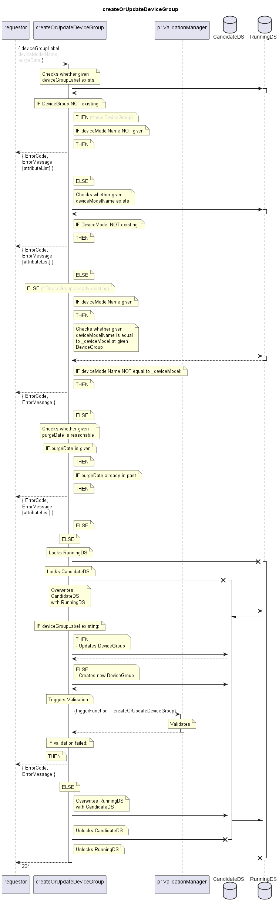

# createOrUpdateDeviceGroup

Creates a new DeviceGroup if there is none with the given label.  
Otherwise the existing DeviceGroup is updated in the given attributes.  

## Diagram

  

## Interface

Please find a detailed description of the interface in the [openAPI specification](../../../FirmWareManager.yaml).  

## Variables

Please find a detailed description of the [variables](./variables.yaml).  

## Error Codes

| Code | Message                                                                                                  |
|------|----------------------------------------------------------------------------------------------------------|
|      | Input incomplete                                                                                         |
|      | Referenced object does not exist                                                                         |
|      | Mismatch between deviceGroupLabel and deviceModelName                                                    |
|      | Attribute's value is not valid                                                                           |

## Parameters

./.  

## NPM Module

[onf-core-model-ap](https://www.npmjs.com/package/onf-core-model-ap) to be complemented.  
