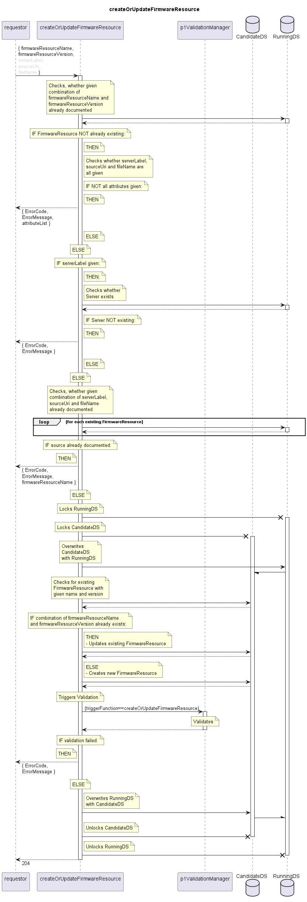

# createOrUpdateFirmwareResource

Creates a new FirmwareResource if there is none with the given name.  
Otherwise the existing FirmwareResource is updated in the given attributes.  

## Diagram

  

## Interface

Please find a detailed description of the interface in the [openAPI specification](../../../FirmWareManager.yaml).  

## Variables

Please find a detailed description of the [variables](./variables.yaml).  

## Error Codes

| Code | Message                                                                                                  |
|------|----------------------------------------------------------------------------------------------------------|
|      | Input incomplete                                                                                         |
|      | Referenced object does not exist                                                                         |
|      | Combination of serverLabel, sourceUri and fileName already documented                                    |

## Parameters

./.  

## NPM Module

[onf-core-model-ap](https://www.npmjs.com/package/onf-core-model-ap) to be complemented.  
