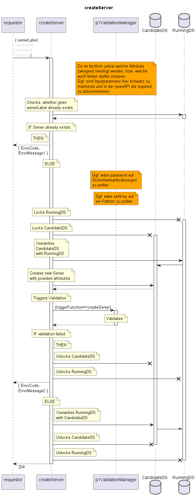

# createServer

Creates a new Server.  

## Diagram

  

## Interface

Please find a detailed description of the interface in the [openAPI specification](../../../FirmWareManager.yaml).  

## Variables

Please find a detailed description of the [variables](./variables.yaml).  

## Error Codes

|#| Code | Message                                                               |
|-|------|-----------------------------------------------------------------------|
|1|      | Server already exists                                                 |
|2|      | _[provided by ValidationFunctions]_                                   |

## Parameters

./.  

## NPM Module

[onf-core-model-ap](https://www.npmjs.com/package/onf-core-model-ap) to be complemented.  
