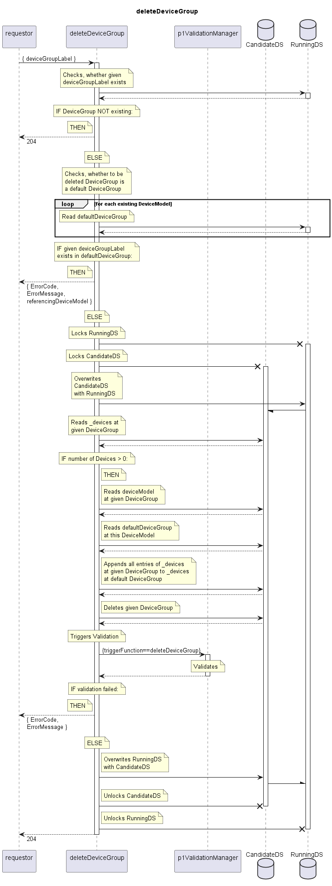

# deleteDeviceGroup

Deletes a DeviceGroup.  
If the DeviceGroup to be deleted is referenced in defaultDeviceGroup at any DeviceModel, the deletion will be aborted.  
The deviceModelName will be returned in that case.  
If the DeviceGroup to be deleted is referencing any Devices, same references get created in their default DeviceGroup.  

## Diagram

  

## Interface

Please find a detailed description of the interface in the [openAPI specification](../../../FirmWareManager.yaml).  

## Variables

Please find a detailed description of the [variables](./variables.yaml).  

## Error Codes

| Code | Message                                                                                                  |
|------|----------------------------------------------------------------------------------------------------------|
|      | To be deleted DeviceGroup is default DeviceGroup                                                        |

## Parameters

./.  

## NPM Module

[onf-core-model-ap](https://www.npmjs.com/package/onf-core-model-ap) to be complemented.  
