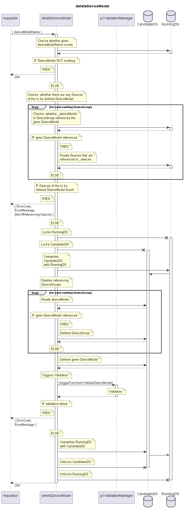

# deleteDeviceModel

Deletes a DeviceModel and all referencing DeviceGroups.  
If any Device is still referenced by any of the DeviceGroups that are referencing the DeviceModel, the deletion will be aborted.  
A list of Devices will be returned in that case.  

## Diagram

  

## Interface

Please find a detailed description of the interface in the [openAPI specification](../../../FirmWareManager.yaml).  

## Variables

Please find a detailed description of the [variables](./variables.yaml).  

## Error Codes

| Code | Message                                                                                                  |
|------|----------------------------------------------------------------------------------------------------------|
|      | To be deleted object still referenced                                                                    |

## Parameters

./.  

## NPM Module

[onf-core-model-ap](https://www.npmjs.com/package/onf-core-model-ap) to be complemented.  
