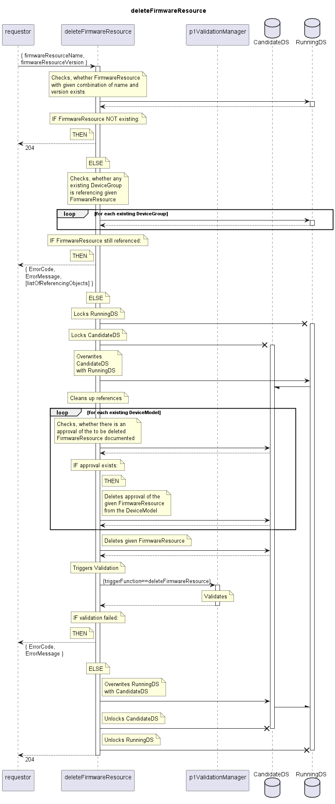

# deleteFirmwareResource

Deletes a FirmwareResource.  
Aborts if the FirmwareResource is still referenced by any DeviceGroup.  
Removes obsolete references (approvals documented in DeviceModels).  

## Diagram

  

## Interface

Please find a detailed description of the interface in the [openAPI specification](../../../FirmWareManager.yaml).  

## Variables

Please find a detailed description of the [variables](./variables.yaml).  

## Error Codes

| Code | Message                                                                                                  |
|------|----------------------------------------------------------------------------------------------------------|
|      | To be deleted object still referenced                                                                    |

## Parameters

./.  

## NPM Module

[onf-core-model-ap](https://www.npmjs.com/package/onf-core-model-ap) to be complemented.  
