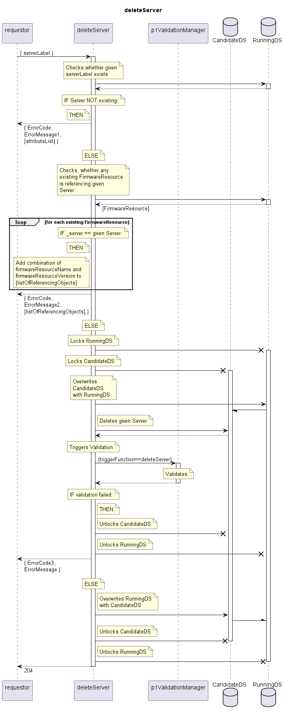

# deleteServer

Deletes a Server.  
Aborts if the Server is still referenced by any FirmwareResource.  

## Diagram

  

## Interface

Please find a detailed description of the interface in the [openAPI specification](../../../FirmWareManager.yaml).  

## Variables

Please find a detailed description of the [variables](./variables.yaml).  

## Error Codes

|#| Code | Message                               |
|-|------|---------------------------------------|
|1|      | Referenced object does not exist      |
|2|      | To be deleted object still referenced |
|3|      | _[provided by ValidationFunctions]_   |

## Parameters

./.  

## NPM Module

[onf-core-model-ap](https://www.npmjs.com/package/onf-core-model-ap) to be complemented.  
