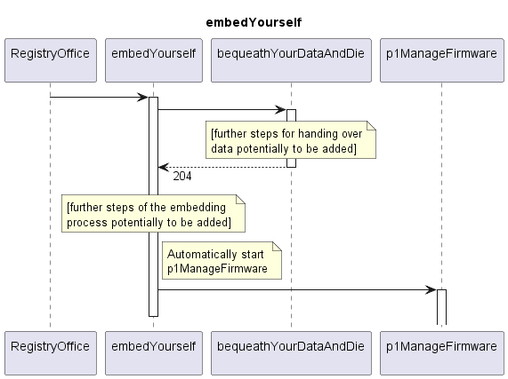

# embedYourself

## Overview

The embedYourself Service is called by the RegistryOffice application.  
It initiates the necessary steps to embed the new application into the MW SDN application layer.  
It also starts Functions that run permanently during runtime of the new application.  

## Diagram

  

## Interface

Please find a detailed description of the interface in the [openAPI specification](../../../FirmWareManager.yaml).  

## NPM Module

[onf-core-model-ap](https://www.npmjs.com/package/onf-core-model-ap) to be complemented.  
