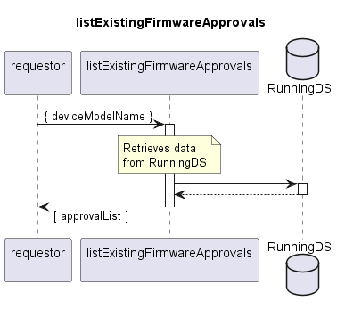

# listExistingFirmwareApprovals

Returns list of references to FirmwareResources that have been approved for a DeviceModel.  
References to FirmwareResources are composed from firmware name and version.  

## Diagram

  

## Interface

Please find a detailed description of the interface in the [openAPI specification](../../../FirmWareManager.yaml).  

## Variables

Please find a detailed description of the [variables](./variables.yaml).  

## Error Codes

./.  

## Parameters

./.  

## NPM Module

[onf-core-model-ap](https://www.npmjs.com/package/onf-core-model-ap) to be complemented.  
