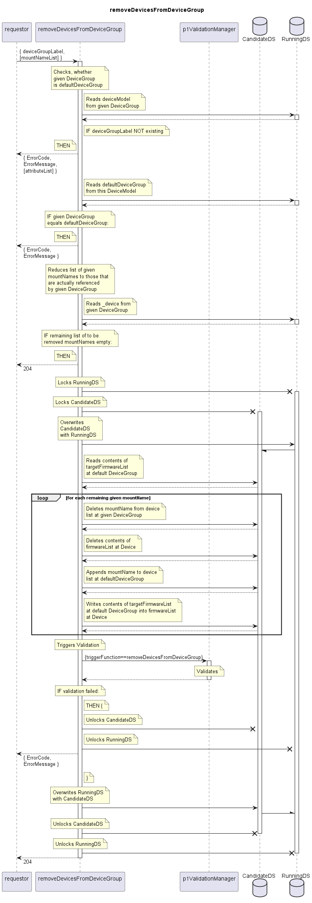

# removeDevicesFromDeviceGroup

Removes the given mountNames from the device list of a given DeviceGroup.  
Appends them to the device list of the default DeviceGroup of the same deviceModel.  
Updates the firmwareList of the given Devices.  

Consequences: The target firmware of the default DeviceGroup will be attempted to be loaded onto the devices and activated.  

## Diagram

  

## Interface

Please find a detailed description of the interface in the [openAPI specification](../../../FirmWareManager.yaml).  

## Variables

Please find a detailed description of the [variables](./variables.yaml).  

## Error Codes

./.

## Parameters

./.  

## NPM Module

[onf-core-model-ap](https://www.npmjs.com/package/onf-core-model-ap) to be complemented.  
