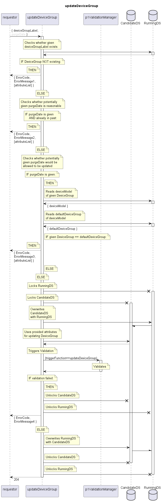

# updateDeviceGroup

Updates an existing DeviceGroup definition.  
As deviceModelName is invariant, and targetFirmwareList and _device are managed by dedicated services, this service is limited to updating the purgeDate.  

## Diagram

  

## Interface

Please find a detailed description of the interface in the [openAPI specification](../../../FirmWareManager.yaml).  

## Variables

Please find a detailed description of the [variables](./variables.yaml).  

## Error Codes

|#| Code | Message                                                           |
|-|------|-------------------------------------------------------------------|
|1|      | Referenced object does not exist                                  |
|2|      | Attribute's value is not valid                                    |
|3|      | Default DeviceGroup cannot have purgeDate                         |
|4|      | _[provided by ValidationFunctions]_                               |

## Parameters

./.  

## NPM Module

[onf-core-model-ap](https://www.npmjs.com/package/onf-core-model-ap) to be complemented.  
