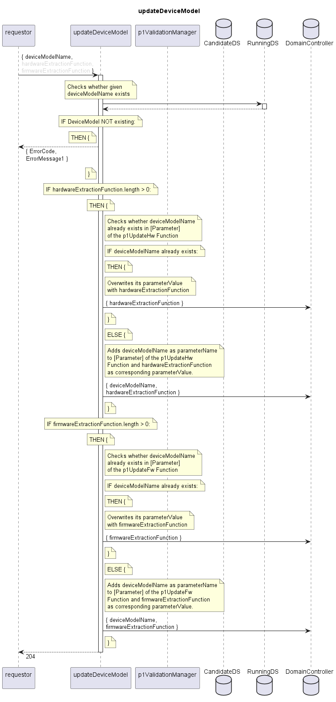

# updateDeviceModel

Updates the MeasurementFunctions of an already documented DeviceModel.  
Provided hardwareExtractionFunction and/or firmwareExtractionFunction are added to the Parameters of the corresponding MeasurementFunctions in the DomainController.  

## Diagram

  

## Interface

Please find a detailed description of the interface in the [openAPI specification](../../../FirmWareManager.yaml).  

## Variables

Please find a detailed description of the [variables](./variables.yaml).  

## Error Codes

|#| Code | Message                                                           |
|-|------|-------------------------------------------------------------------|
|1|      | deviceModelName does not exist                                    |

## Parameters

./.  

## NPM Module

[onf-core-model-ap](https://www.npmjs.com/package/onf-core-model-ap) to be complemented.  
