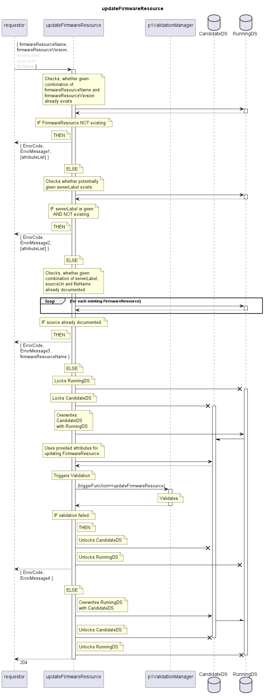

# updateFirmwareResource

Updates an existing FirmwareResource.  

## Diagram

  

## Interface

Please find a detailed description of the interface in the [openAPI specification](../../../FirmWareManager.yaml).  

## Variables

Please find a detailed description of the [variables](./variables.yaml).  

## Error Codes

|#| Code | Message                                                               |
|-|------|-----------------------------------------------------------------------|
|1|      | Referenced object does not exist                                      |
|2|      | Referenced object does not exist                                      |
|3|      | Combination of serverLabel, sourceUri and fileName already documented |
|4|      | _[provided by ValidationFunctions]_                                   |

## Parameters

./.  

## NPM Module

[onf-core-model-ap](https://www.npmjs.com/package/onf-core-model-ap) to be complemented.  
