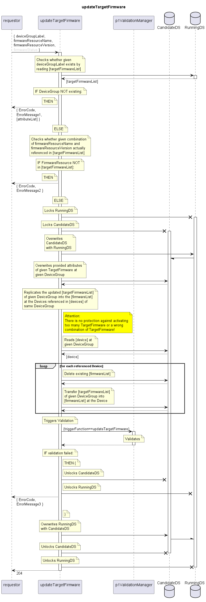

# updateTargetFirmware

Updates an entry in the targetFirmwareList of a given DeviceGroup in the provided attributes (currently limited to the administrative state of the firmware).  
Replicates the same changes into the firmwareList of all Devices referenced by the given DeviceGroup.  

Attention: There is no protection against activating too many TargetFirmware or a wrong combination of TargetFirmware!

Consequences: The firmware will be attempted to be loaded onto the devices.  

## Diagram

  

## Interface

Please find a detailed description of the interface in the [openAPI specification](../../../FirmWareManager.yaml).  

## Variables

Please find a detailed description of the [variables](./variables.yaml).  

## Error Codes

|#| Code | Message                                                           |
|-|------|-------------------------------------------------------------------|
|1|      | Referenced object does not exist                                  |
|2|      | Firmware not referenced in targetFirmwareList                     |
|3|      | _[provided by ValidationFunctions]_                               |

## Parameters

./.  

## NPM Module

[onf-core-model-ap](https://www.npmjs.com/package/onf-core-model-ap) to be complemented.  
