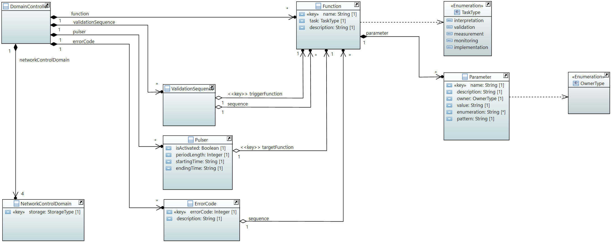
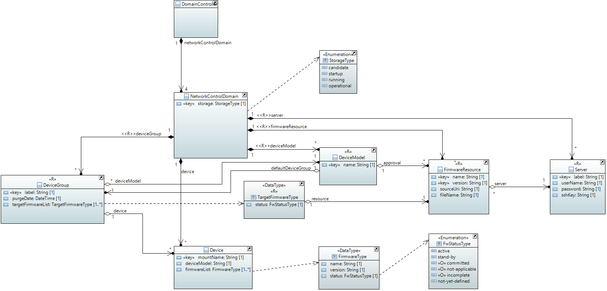

# Information Structure

## DomainController

The information structure of the DomainController is close to the one already developed for the ControllerDomainManager.  
Few improvements have been made based on the DevicePerformanceManagementDataProcessor.  

  

## NetworkControlDomain

The information structure specific for the FirmWare domain contains the necessary information for  

- executing the [RPCs for installing and activating new firmware](OnfRpcsAndClasses.md) on the devices
- validating the pairings of individual device and its firmware in CandidateDS against general firmware approvals

The most relevant operations are supported in being executed in an efficient and fast way (see also [estimated number of repetitions of the most relevant operations](./EstimatedRepetitions.md)).

  

