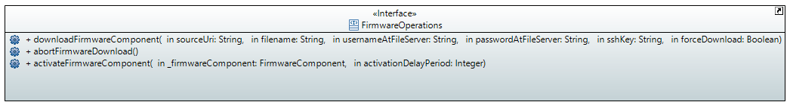

# Information Structure

## Design Targets

The information structure has to contain the necessary information for ...

- executing the RPCs for installing and activating a new firmware on the devices
- validating the firmware in CandidateDS against
  - the approvals
  - the hardware of the devices

It has to support performance by being ...

- ... light weight
- ... optimized for the most often executed operations

## RPC Parameters

The RPCs for installing and activating a new firmware need the following input parameters:  

  

## Relevant Operations

The following operations must be executed efficiently and fast.  

### Measurement

**Repetitions**  
The information about the device is updated in OperationalDS.  
To be executed with new information being available from the network.  

Design decision:  
\- The input interface of the DPMDP is re-used.  

This results in a frequency of 320,000 devices/day.  

### Monitoring

**Repetitions**  
Alarm list must be updated based on differences between RunningDS and OperationalDS.  

Design decisions:  
\- Comparison is not triggered by time (Pulser), but by changes in either OperationalDS or RunningDS.  
\- Comparison is limited to changed devices; its not required to compare the entire data store content.  

Re-use of the DPMDP input interface and sporadic input results in a frequency of 324,000 devices/day.  

**Processing**  
The OperationalDS might contain more information about the device than the RunningDS.  

Design decisions:  
\- The comparison is limited to checking the content of the RunningDS for contradictions with the content of the OperationalDS.  
\- Differences in some attributes (deviceModelName, actualEquipmentTypeList) lead to immediate update of the RunningDS (which might cause a need for updating the firmware attribute, too).  
\- Apart from availability of the firmware component, its activation status is also checked.

### Validation

The firmware in the CandidateDS must be validated against the approvals.  
This includes checking for compatibility with the actual hardware of the devices before transferring to RunningDS

**Repetitions**  
Changing the device group of a device requires to at least validate this device (administrative event).  
Changing the firmware at a device group requires to at least validate all devices in this group (operational event).  

Assumptions:  
\- 50 administrative events/day  
\- 4 operational events/year  
\- administrative events affect a single device only  
\- operational events affect 15,000 devices  

Design decisions:  
\- In case of an administrative event, only the affected devices are validated.  
\- In case of an operational event, all devices are validated (not just the ones in the affected group).  

This requires 50 devices/day and 160,000 devices/year, which results in 550 devices/day.  

**Processing**  
Assumptions:  
\- The ControlConstruct::actualEquipmentTypeList in CandidateDS is copied from RunningDS, which is copied from OperationalDS.  
\- It contains a lot of equipment types, which are covered by firmware components that are parts of some firmware package.  
\- These equipment types are not listed in the Approval::approvedEquipmentTypeList.  
\- So checking for all equipment types listed in ControlConstruct::actualEquipmentTypeList being covered by an entry in Approval::approvedEquipmentTypeList would fail.  
\- If the approval of a firmware component is restricted to specific hardware, there might be more than one entry in Approval::approvedEquipmentTypeList  

Design decisions:  
\- A firmware component from ControlConstruct::firmwareList in CandidateDS is considered to be approved, if  
  \- the combination of {Firmware::firmwareComponentName and Firmware::firmwareComponentVersion} can be found in {FirmwareResource::firmwareComponentName and FirmwareResource::firmwareComponentVersion}  
  \- AND the value of ControlConstruct::deviceModelName can be found in Approval::deviceModelName of the approvalList of this instance of FirmwareResource  
  \- AND  
    \- the Approval::approvedEquipmentTypeList is either empty  
    \- OR at least one of the values of Approval::approvedEquipmentTypeList can be found in ControlConstruct::actualEquipmentTypeList

## Relevant Device Information

### mountName

The FWM has to learn the devices in the network from somewhere.  

Assumptions:  
\- Planning data is not useful, because it will always differ from the actual network.  

Design decision:  
\- The FWM is learning every new device by receiving its data from the MWDI.  
\- Existing categorizations of devices into device groups shall not be lost, because of temporary unavailability of the DCN.  
\- The FWM is **not** deleting any device from its data store, because of not receiving any new data from the MWDI.  

This will lead to an increasing number and share of unsuccessful attempts to download and activate some firmware on devices that are no longer available in the network.  

The mountName is retrieved from the ControlConstructPac::externalLabel attribute.  

### firmwareList

The ONF information model provides a harmonized information structure for firmware.  
Nevertheless, the structure of firmware differs significantly by the implementations of the individual device types.  

In general the ONF information model allows to distinguish between firmware packages and firmware components that are specific to some hardware component.  
It also allows indicating, whether some firmware component can be activated individually.  

Assumptions:  
\- Active management of firmware can be limited to those components that can be activated individually.  

Design decision:  
\- Throughout the entire FWM application, dealing with firmware is limited to those firmware components that can be activated individually (individualActivationIsAvail==true).  

### deviceModelName

The deviceModelName is considered to be the minimum criteria for assessing firmware compatibility.  
It is retrieved from the ControlConstructPac::deviceModelName attribute.  

### actualEquipmentTypeList

The approval of some firmware components might be restricted to specific hardware components.  
Checking for the firmwareList to match the actual hardware of the device must be part of the validation of the CandidateDS.  

Design decision:  
\- The actualEquipmentTypeList is to be filled from the ...  

_It is currently not clear with which values the approvals could be properly expressed and which attribute to be retrieved from the device.  
Completeness of the content of the EquipmentType::typeName attribute might fall short the need.  
Number of different entries in Equipment::ManufacturedThing::EquipmentType::modelIdentifier might be too high to be kept up-to-date in the approvals._  
