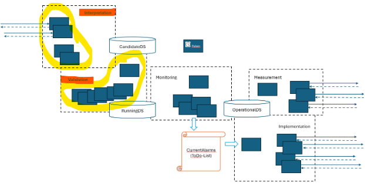
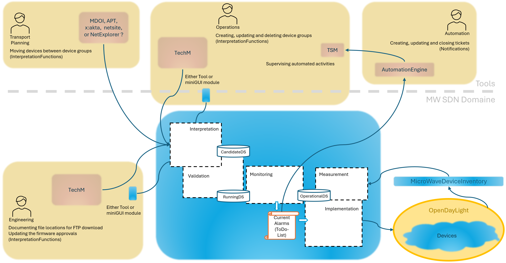
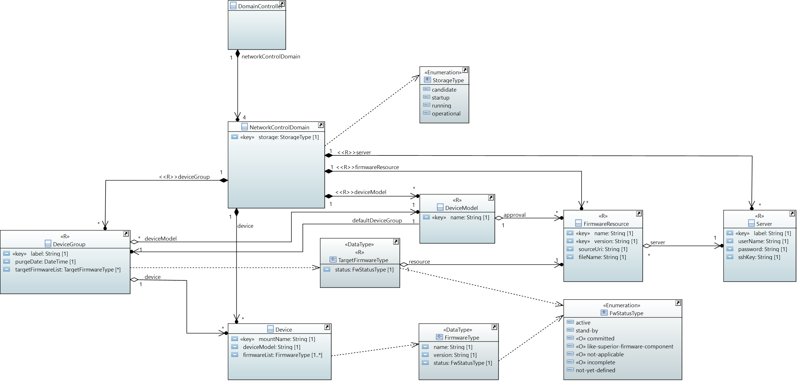

# User Stories

## Introduction

Die unten aufgeführten User Stories beschreiben die InterpretationServices and ValidationFunctions,  

  

    
  

die im Rahmen des beschriebenen Rollenmodells  

  

    
  

dafür benötigt werden, um den Zielzustand in der RunningDS zu formulieren.  

  

    
  

## Representation

Die Darstellung im nachfolgenden Listing ist wie folgt strukturiert:  

- User Stories
  - Arbeitsschritte
    - /service-aufrufe
      - p1ValidierungFunktionAufrufe / t1PostmanTestCases  

Geklammerte _Serviceaufrufe_ und _p1ValidierungFunktionAufrufe_ kennzeichnen einen Re-use.  

Postman _t1TestCases_ dienen der Überprüfung der Datenkonsistenz (z.B. eine Gruppenzuweisung ist für jedes Gerät dokumentiert).  

_p1ValidierungFunktionAufrufe_ dienen der Überprüfung der interpretierten Eingaben auf technische Konformität (z.B. Gerät und Gruppenzuweisung sind konform mit HW-FW-Kompatibilität).  

## Consumer Services and Validation Functions

- **Documenting firmware approvals (Engineering)**
  - Preparing servers
    - /list-existing-servers
    - /list-incomplete-servers (to choose one to be completed)
    - /create-or-update-server
      - t1CheckForAssuranceOfUniqueLabels
    - /delete-server  
      (must not be deleted if still referred by FirmwareResource)
      - t1CheckForAssuranceOfEveryFirmwareResourceHavingAServer
  - Preparing firmware resources
    - /list-existing-firmware-resources
    - /list-incomplete-firmware-resources (to choose one to be completed)
    - (/list-existing-servers (to choose from during create or update))
    - /create-or-update-firmware-resource  
      (existing name and version combinations indicate an update)
      - t1CheckForAssuranceOfUniqueNameAndVersionCombinations
      - t1CheckForAssuranceOfServerToExist
      - t1CheckForAssuranceOfUniqueServerAndSourceUriAndFileNameCombinations
    - /delete-firmware-resource  
      (must not be deleted if still referred by TargetFirmwareType)  
      (might be deleted, despite of existing approvals)
      - t1CheckForAssuranceOfTargetFirmwareNotBeingDeleted
      - t1CheckForDeletionOfAllExistingApprovalsOfDeletedFirmwareResource
  - Preparing device models
    - /list-existing-device-models
    - /list-unknown-device-models (to choose one to be created)
    - /create-device-model  
      (comprises  
        creating the DeviceModel  
        creating the default DeviceGroup  
        referencing all existing Devices of same deviceModel in default DeviceGroup)
      - t1CheckForAssuranceOfUniqueNames
      - t1CheckForDefaultDeviceGroupBeingCreated
      - t1CheckForAllDevicesOfDeviceModelNameBeingReferredByDefaultDeviceGroup
      - p1EnsureEveryDeviceBeingReferredByOneDeviceGroupOfItsDeviceModel
    - /delete-device-model  
      (must not be deleted if a Device with same deviceModel exists)  
      (comprises deleting all DeviceGroups with same _deviceModel)
      - t1CheckForAssuranceOfDeviceModelNotBeingDeletedIfDeviceExists
      - t1CheckForAllDeviceGroupsOfSameDeviceModelBeingDeleted
      - (p1EnsureEveryDeviceBeingReferredByOneDeviceGroupOfItsDeviceModel)
  - Documenting firmware approvals
    - (/list-existing-device-models (to choose the one for documenting an approval))
    - /list-device-models-without-approvals (to choose one for documenting an approval)
    - /list-existing-firmware-approvals
    - (/list-existing-firmware-resources (to choose from during add))
    - /add-firmware-approval
    - /remove-firmware-approval  
      (must not be deleted if FirmwareResource still referred by any DeviceGroup)
      - t1CheckForAssuranceOfApprovalNotBeingDeletedWhileReferredByDeviceGroup
      - p1EnsureEveryDeviceReferencingExclusivelyApprovedFirmware
- **Preparing device groups and initiating firmware roll-out (Operations)**
  - Preparing device groups
    - /list-existing-device-groups
    - (/list-existing-device-models (to choose from during create))
    - (/list-existing-firmware-resources (to choose default during create))
    - /create-or-update-device-group  
      (existing label indicates an update)  
      (create does not allow creating entries in targetFirmwareList or device list)  
      (update does not allow changing targetFirmwareList or device list, just purgeDate)
      - t1CheckForAssuranceOfUniqueLabels
      - t1CheckForAssuranceAgainstNoneExistingDeviceModels
      - t1CheckForAssuranceAgainstDeviceModelMismatch
      - t1CheckForAssuranceAgainstPurgeDateAtDefaultDeviceGroup
      - t1CheckForAssuranceAgainstPastPurgeDate
    - /delete-device-group  
      (default DeviceGroups must not be deleted)  
      (still grouped devices to be transferred to default DeviceGroup of same deviceModel)
      - t1CheckFor204ForUnknownDeviceGroup
      - t1CheckForAssuranceAgainstDeletingDefaultDeviceGroup
      - t1CheckForReferredDevicesBeingTransferredToDefaultDeviceGroup
      - (p1EnsureEveryDeviceBeingReferredByOneDeviceGroupOfItsDeviceModel)
  - Initiate firmware roll-out
    - (/list-existing-device-groups (to choose the one for initiating roll-out))
    - /list-device-groups-without-target-firmware (to choose the one for initiating roll-out))
    - /provide-existing-device-group
    - (/list-existing-firmware-resources (to choose from during initiating roll-out))
    - /add-or-update-target-firmware  
      (must not be added if not approved for the deviceModel of the DeviceGroup)
      - t1CheckForAssuranceAgainstUnapprovedFirmware
      - t1CheckForNewTargetFirmwareBeingReplicatedIntoDevices
      - t1CheckForStatusChangesBeingReplicatedIntoDevices
      - p1EnsureEveryDeviceHasFirmwareAsTargetOfItsGroup
    - /delete-target-firmware  
      (does not have effect on real devices)
      - t1CheckForTargetFirmwareDeletionBeingReplicatedIntoDevices
      - (p1EnsureEveryDeviceHasFirmwareAsTargetOfItsGroup)
- **Categorizing individual devices into device groups (Planning)**
  - Preparing devices
    - p1InstantiateDevice (function, not a service)  
      (Devices to be imported from OperationalDS to RunningDS)
      - (p1EnsureEveryDeviceBeingReferredByOneDeviceGroupOfItsDeviceModel)
      - (p1EnsureEveryDeviceHasFirmwareAsTargetOfItsGroup)
  - Categorizing individual devices into device groups
    - /list-existing-devices (to choose one to be added to a device group)
    - (/list-existing-device-groups (to choose one to be complemented))
    - /list-device-groups-without-devices (to choose one to be complemented)
    - /add-devices-to-device-group  
      (comprises  
        removing the Device from its current DeviceGroup,  
        adding the Device to the new DeviceGroup,  
        transferring DeviceGroup::targetFirmwareList to Device::firmwareList)  
      - t1CheckForAssuranceAgainstNoneExistingDeviceGroups
      - t1CheckForAssuranceAgainstNoneExistingDevices
      - t1CheckForAssuranceAgainstDeviceModelMismatch
      - t1CheckForCleanUpInFormerDeviceGroup
      - t1CheckForEntryInNewDeviceGroup
      - t1CheckForTransferOfTargetFirmwareToDevice
      - (p1EnsureEveryDeviceBeingReferredByOneDeviceGroupOfItsDeviceModel)
      - (p1EnsureEveryDeviceHasFirmwareAsTargetOfItsGroup)
      - (p1EnsureEveryDeviceReferencingExclusivelyApprovedFirmware)
    - /remove-device-from-device-group
      (comprises  
        removing the Device from its current DeviceGroup,  
        adding the Device to the default DeviceGroup of its deviceModel,
        transferring default DeviceGroup::targetFirmwareList to Device::firmwareList)  
      - t1CheckForCleanUpInFormerDeviceGroup
      - t1CheckForEntryInDefaultDeviceGroup
      - t1CheckForTransferOfTargetFirmwareToDevice
      - (p1EnsureEveryDeviceBeingReferredByOneDeviceGroupOfItsDeviceModel)
      - (p1EnsureEveryDeviceHasFirmwareAsTargetOfItsGroup)
      - (p1EnsureEveryDeviceReferencingExclusivelyApprovedFirmware)

